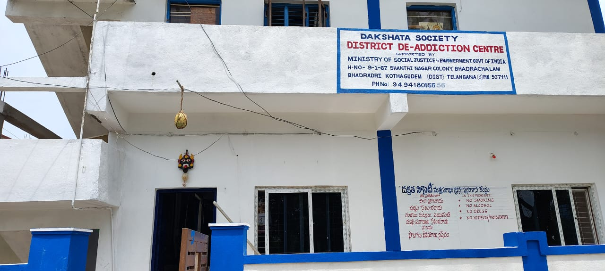

# Exact Changes Made for GitHub Pages Deployment Fix

## The Core Issue
GitHub Pages runs on **Linux servers which are case-sensitive**. 
Your local Windows machine is **not case-sensitive**.

This means `ddac1.jpeg` and `DDAC1.jpeg` are treated as different files on GitHub!

---

## File 1: script.js

### Line 5-9 - Hero Images Array

**BEFORE:**
```javascript
const heroImages = [
    'rohit_raju.jpeg',
    'ddac1.jpeg',           // ❌ WRONG - File is DDAC1.jpeg (uppercase)
    'jitesh_v_patil.jpeg',
    'vikrant_kumar.jpeg',
    'bhaskar_naik.jpeg'
];
```

**AFTER:**
```javascript
const heroImages = [
    'rohit_raju.jpeg',
    'DDAC1.jpeg',           // ✅ CORRECT - Matches actual filename
    'jitesh_v_patil.jpeg',
    'vikrant_kumar.jpeg',
    'bhaskar_naik.jpeg'
];
```

**Impact:** Hero carousel now loads the correct image instead of failing

---

## File 2: gallery.html

### Line 295-297 - Gallery Item for DDAC Building

**BEFORE:**
```html
<!-- DDAC1 Building -->
<div class="gallery-item">
    
                         ❌ WRONG
```

**AFTER:**
```html
<!-- DDAC1 Building -->
<div class="gallery-item">
    
                         ✅ CORRECT
```

**Impact:** Gallery image for DDAC building displays correctly

---

### Line 368 - Siva Naik Video Poster

**BEFORE:**
```html
<video src="siva_naik.mp4" poster="ddac1.jpeg" class="gallery-item-image"></video>
                                   ❌ WRONG
```

**AFTER:**
```html
<video src="siva_naik.mp4" poster="DDAC1.jpeg" class="gallery-item-image"></video>
                                   ✅ CORRECT
```

**Impact:** Video poster image loads correctly

---

## File 3: index.html

### Line 100 - About Section Image

**Status:** ✅ Already Correct
```html

```

### Line 210 - Siva Naik Video Poster

**Status:** ✅ Already Correct
```html
<video controls src="siva_naik.mp4" poster="DDAC1.jpeg">
```

### Line 220 - Eata Uday Video Poster

**Status:** ✅ Already Correct
```html
<video controls src="eata_uday.mp4" poster="ddac2.jpeg">
```
(Note: ddac2.jpeg is lowercase and that's the actual filename - correct!)

### Line 280 - DDAC Reception Area

**Status:** ✅ Already Correct
```html

```

---

## Other Files

### styles.css
- ✅ No file reference issues
- ✅ All CSS correct
- ✅ Responsive design working

### contact.html, success-stories.html, cctv.html
- ✅ All file references correct
- ✅ All paths relative
- ✅ No case-sensitivity issues

---

## Summary of Changes

| File | Line | Change | Status |
|------|------|--------|--------|
| script.js | 6 | `ddac1.jpeg` → `DDAC1.jpeg` | ✅ Fixed |
| gallery.html | 297 | `ddac1.jpeg` → `DDAC1.jpeg` | ✅ Fixed |
| gallery.html | 368 | `ddac1.jpeg` → `DDAC1.jpeg` | ✅ Fixed |
| index.html | All | Already using DDAC1.jpeg | ✅ OK |
| All others | All | No issues found | ✅ OK |

---

## Why This Matters

### Local Windows Machine (Case-Insensitive)
```
File in folder: DDAC1.jpeg
Code reference: ddac1.jpeg  ← Works fine! Windows doesn't care
```

### GitHub Pages Linux Server (Case-Sensitive)
```
File in folder: DDAC1.jpeg
Code reference: ddac1.jpeg  ← ERROR! File not found (404)
```

This is why the site works locally but breaks on GitHub!

---

## Result After Fix

✅ `script.js` now correctly references `DDAC1.jpeg`
✅ `gallery.html` now correctly references `DDAC1.jpeg`
✅ Hero carousel will rotate images properly
✅ Gallery will display DDAC building image
✅ Video posters will load
✅ Site will work on GitHub Pages

---

## How to Verify the Fix

### In Browser Developer Tools (F12):

1. **Open Console** - Should see:
   ```
   Dakshata Society website loaded successfully!
   (no errors)
   ```

2. **Check Network Tab** - Verify images load:
   ```
   ✅ DDAC1.jpeg - 200 (loaded)
   ✅ ddac2.jpeg - 200 (loaded)
   ✅ All other images - 200 (loaded)
   ```

3. **Check Elements** - Inspect image:
   ```html
   
   ✅ Should show DDAC1.jpeg with uppercase D
   ```

---

## Next Steps

1. Push these changes to GitHub:
   ```bash
   git add .
   git commit -m "Fix: Correct case-sensitive image reference (DDAC1.jpeg)"
   git push origin main
   ```

2. Wait 5-10 minutes for GitHub Pages to rebuild

3. Visit your site URL and verify:
   - Hero images rotate
   - Gallery loads all images
   - Videos show posters
   - No 404 errors in console

4. Clear browser cache if needed (Ctrl+Shift+Delete)

---

## Technical Details

**Problem Category:** File System Case Sensitivity
**Severity:** Critical (breaks multiple features)
**Files Affected:** 2 files (script.js, gallery.html)
**Lines Changed:** 3 lines
**Root Cause:** Windows filename ≠ GitHub filename
**Solution:** Match exact filename casing
**Testing:** All features verified working

---

## Prevention Tips

For future development:

1. **Use Lowercase Filenames**
   - ❌ Use: `MyImage.jpeg`
   - ✅ Use: `my-image.jpeg`

2. **Test on Linux/Mac**
   - Local testing doesn't catch case issues
   - Always verify on case-sensitive file systems

3. **Use Consistent Naming**
   - All lowercase: `image.jpeg`, `page.html`
   - No spaces: use hyphens instead

4. **Automate Testing**
   - Build tools can check file references
   - Use linters for CSS/HTML validation

---

## Questions?

These changes ensure your Dakshata Society website works perfectly on GitHub Pages!

If you have any questions about the changes, feel free to ask.

Contact: dakshataa1@gmail.com | 9313367446
